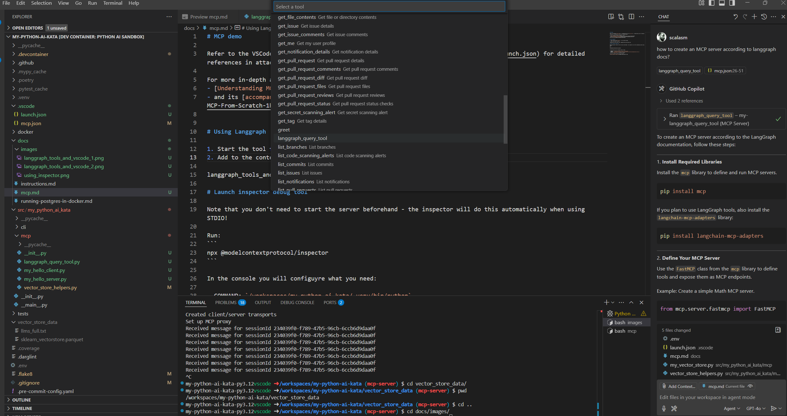
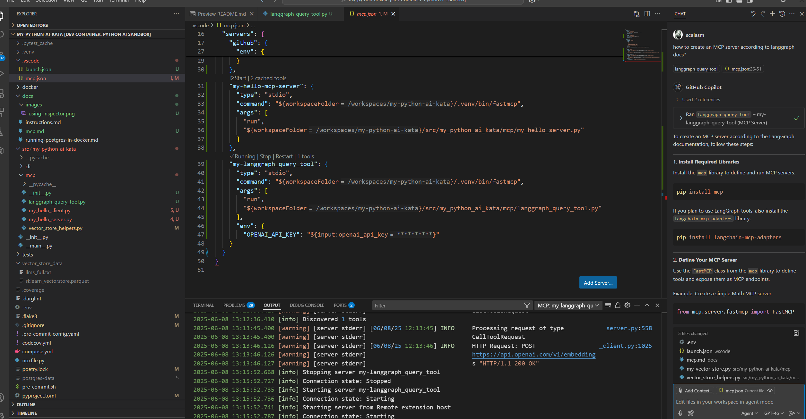
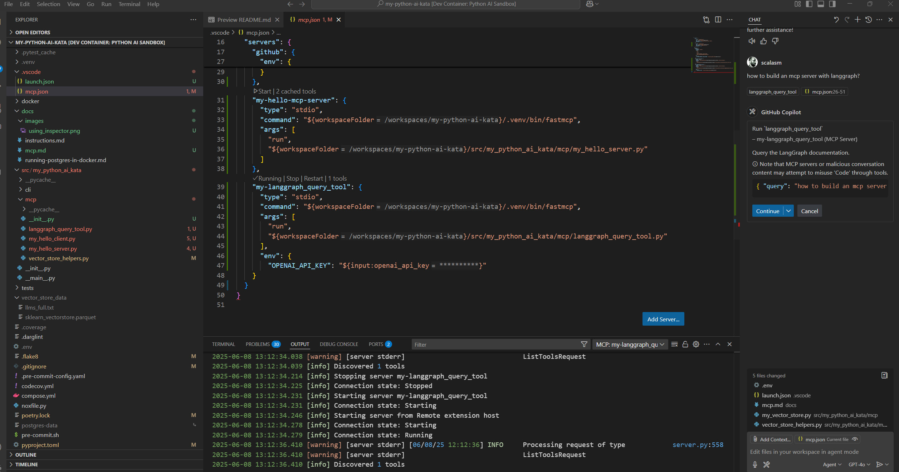
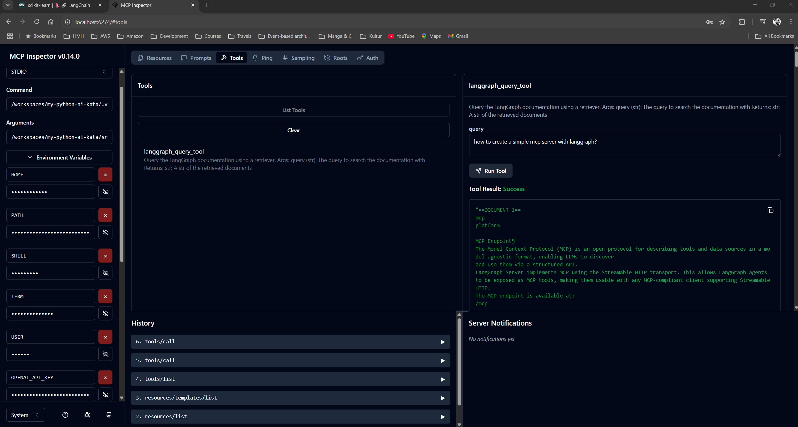

# MCP demo

Refer to the VSCode [launch.json](../.vscode/launch.json) and [mcp.json](../.vscode/launch.json) for detailed references in attaching your MCP tools to VSCode Copilot.

For more in-depth and general guidance, look at 
- [Understanding MCP from scratch](https://www.youtube.com/watch?v=CDjjaTALI68)
- and its [accompanying video notes](https://mirror-feeling-d80.notion.site/MCP-From-Scratch-1b9808527b178040b5baf83a991ed3b2)


# Using Langgraph

1. Start the tool from `mcp.json`, if not started already
2. Add to `Copilot context` our tool
  
3. ask for something Langgraph related, like "how to create an MCP server according to langgraph docs?"
4. Approve the use of the tool by Copilot.
  
5. See how Copilot has used those information to create a (hopefully non-hallucinated) answer.
  

# Launch inspector debug tool

Note that you don't need to start the server beforehand - the inspector will do this automatically when using STDIO!

Run:
```
npx @modelcontextprotocol/inspector
```

In the console you will configuyre what you need:

- COMMAND: `/workspaces/my-python-ai-kata/.venv/bin/python`
- ARGUMENTS: `/workspaces/my-python-ai-kata/src/my_python_ai_kata/mcp/langgraph_query_tool.py`
- Add the `OPENAI_API_KEY` environment variable!

So you can invoke the tools and see resources:

